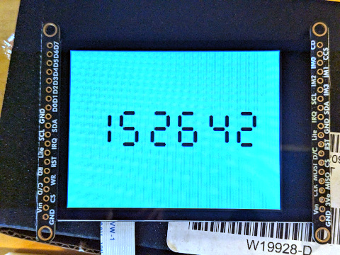

# LVGL

## Design
LVGL executes in its own FreeRTOS task, which has a higher priority than the MicroPython task allowing LVGL to preemptively update the display for smoother animations and effects. LVGL also allocates its own memory and does not use the MicroPython GC heap. Thus LVGL has the same execution and memory environment as it does when running without MicroPython, which reduces integration issues both now and as both projects change.

The MicroPython/LVGL API is hand-written, which allows development of a more "Pythonic" interface. See code examples below.

The display driver is written in C and uses DMA transfers to the SPI peripheral. Although still technically possible to write a display driver in MicroPython, it loses the benefits of low latency display updates.

## Download
Pre-built firmware that includes LVGL:
- [RPI PICO](https://github.com/gneverov/micropythonrt/releases/download/v0.0.0_lvgl/rpi_pico.uf2)
- [RPI PICO W](https://github.com/gneverov/micropythonrt/releases/download/v0.0.0_lvgl/rpi_pico_w.uf2)

N.B. The firmware on the [main page](/README.md) does not contain LVGL.

## Hardware setup
These examples require a display, and ideally an input device. The following displays and input devices are supported:
- ILI9431 (display)
- FT6204 (touch)

A suggested board with both these devices is [this](https://www.adafruit.com/product/2090).

There a numerous pins and bus settings to get right. You will need to edit this config section [here](__init__.py) to suit your situation.

```
# SPI instance for display
SPI_ID = 0

# SPI baudrate for display
SPI_BAUDRATE = 40000000

# SPI data pins for display
SCK, MOSI, MISO = 18, 19, 16

# SPI CS pin for display
CS = 20

# Data/Command pin for display
DC = 22

# I2C instance for touch indev
I2C_ID = 1

# I2C frequency for touch indev
I2C_FREQ = 400000

# I2C data pins for touch indev
SCL, SDA = 27, 26

# Interrupt pin for touch
TRIG = 15

# Backlight on/off pin for display
lite = machine.Pin(28, machine.Pin.OUT, value=1)

# Reset pin for display
rst = machine.Pin(21, machine.Pin.OUT, value=1)
```

## Examples
A few examples have been ported from the official LVGL [examples](https://github.com/lvgl/lvgl/tree/master/examples/get_started) collection.

```
def get_started_1():
    lvgl.display.screen.bg_color = 0x003a57
    lvgl.Label(text = "Hello world", text_color=0xffffff, align=lvgl.ALIGN_CENTER)
    lvgl.run_forever()


def get_started_2():
    btn = lvgl.Button(x=10, y=10, width=120, height=50)
    lbl = lvgl.Label(btn, text="Button", align=lvgl.ALIGN_CENTER)

    btn.count = 0
    def btn_event_cb(e):
        if e.code == lvgl.EVENT_CLICKED:
            btn.count += 1
            lbl.text = f"Button: {btn.count}"

    btn.add_event(btn_event_cb, lvgl.EVENT_ALL)
    lvgl.run_forever()


def get_started_4():
    slider = lvgl.Slider(width=200, align=lvgl.ALIGN_CENTER)
    label = lvgl.Label(text="0")
    label.align_to(slider, lvgl.ALIGN_OUT_TOP_MID, 0, -15)

    def slider_event_cb(e):
        label.text = str(slider.value)

    slider.add_event(slider_event_cb, lvgl.EVENT_VALUE_CHANGED)
    lvgl.run_forever()
```

### Clock
The [clock](clock.py) example demonstrates a ticking digital clock.


